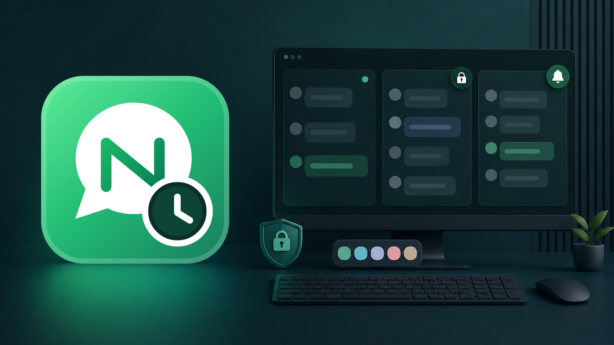
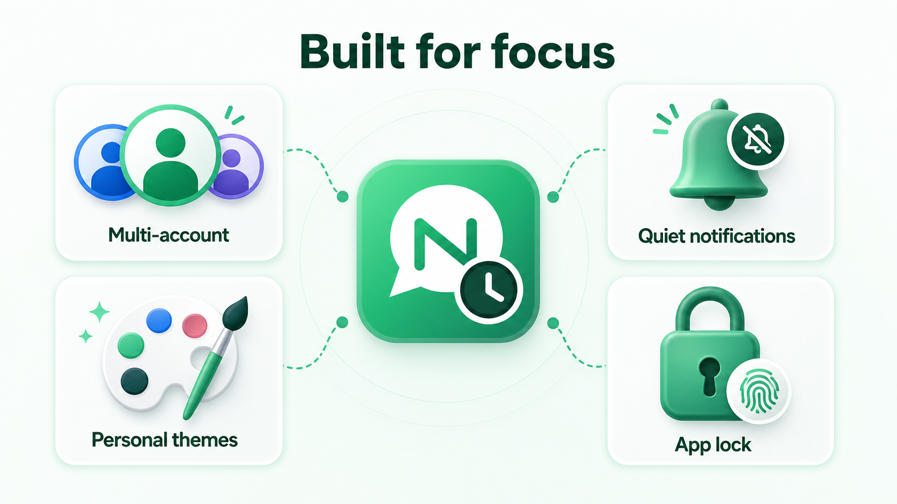
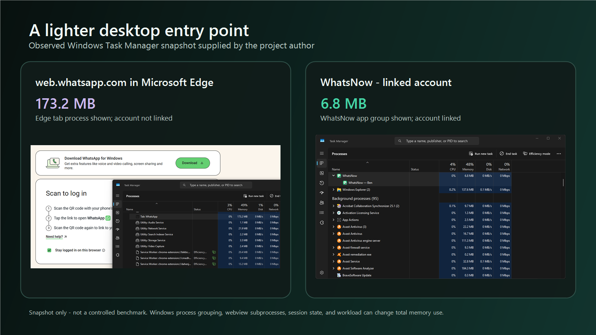

  

  
  
  

# WhatsNow

WhatsNow is an independent desktop client that combines the official WhatsApp
Web service with focused desktop controls. It is designed for people who want
multiple accounts, quieter notifications, personal themes, and faster access
without changing how WhatsApp messages are delivered.

This repository distributes WhatsNow 1.1.0, installation helpers, user
documentation, and release checksums. The application source and Settings UI
implementation are not included.

> WhatsNow is an independent, unofficial project. It is not affiliated with,
> endorsed by, or maintained by WhatsApp LLC or Meta Platforms, Inc. WhatsApp
> is a trademark of its respective owner.

## What WhatsNow adds

  

<em>Original concept artwork representing WhatsNow's desktop productivity features.</em>

| Area | WhatsNow 1.1.0 |
| --- | --- |
| Accounts | Separate desktop sessions, switching, renaming, removal, unread state, and per-account notification choices |
| Focus | Preset and custom focus sessions with tray controls |
| Notifications | Native operating-system alerts, foreground suppression, preview controls, and duplicate prevention |
| Appearance | Official-style Dark and Light modes plus Graphite, Midnight, Forest, Ocean, Blush, Lavender, Candy, and Aurora Pastel backgrounds |
| Productivity | Global shortcut, launch at startup, close to tray, start minimized, always on top, and direct browser links |
| Security | App Lock, supported platform biometrics, isolated account profiles, narrow page-to-app permissions, and content-free diagnostics |
| Desktop integration | Profile-based window titles, native tray behavior, taskbar unread state, downloads, and direct drag-and-drop attachments |
| Efficiency | Active WebView2 accounts stay responsive while minimized, tray-hidden, and secondary accounts request the supported low-memory target |

The account window title follows the logged-in WhatsApp profile name. A profile
named Ben appears as `WhatsNow — Ben`.

See the [complete feature guide](docs/FEATURES_AND_COMPARISON.md) for account,
notification, appearance, productivity, security, and platform behavior.

## WhatsNow and the official desktop app

| | WhatsNow | Official WhatsApp desktop app |
| --- | --- | --- |
| Maintainer | Independent project by [@benedictusrey](https://github.com/benedictusrey) | WhatsApp / Meta |
| Service used | Official WhatsApp Web | Official WhatsApp service |
| Best fit | Productivity controls, visual themes, and multiple isolated sessions | First-party support and official store distribution |
| Updates | GitHub Releases | Official WhatsApp distribution channels |
| Support | Community issue tracker and security reports | Official WhatsApp support |

WhatsNow does not replace WhatsApp's network, encryption, account system, or
terms. Changes to WhatsApp Web can affect the desktop experience.

## Observed Windows resource snapshot

  

In the supplied snapshot, Microsoft Edge displayed a `173.2 MB` WhatsApp Web
tab process before the account was linked, while Windows displayed the linked
WhatsNow app group at `6.8 MB`.

This is an illustrative observation, not a controlled benchmark. Edge and
WebView2 can group subprocesses differently, and total memory changes with
session state, extensions, cached data, active chats, media, calls, and runtime
versions. Readers should compare total process trees under the same workload
before drawing performance conclusions.

## Download

Use the [latest GitHub Release](https://github.com/benedictusrey/WhatsNow-for-WhatsApp/releases/latest).

| Platform | Recommended asset |
| --- | --- |
| Windows 10/11 x64 | `WhatsNow_1.1.0_x64-setup.exe` |
| Managed Windows deployment | `WhatsNow_1.1.0_x64_en-US.msi` |
| Portable Windows 10/11 | `WhatsNow.exe` |
| Linux x64 | `WhatsNow_1.1.0_amd64.AppImage` or `.deb` |
| Apple silicon Mac | `WhatsNow_1.1.0_aarch64.dmg` or `.app.tar.gz` |

Only install assets that are actually attached to a published release.
The v1.1.0 Windows packages are staged locally. Linux and macOS assets must be
produced and tested on their respective native build runners before publication;
do not publish placeholder files.

Version 1.1.0 keeps the active account responsive while requesting WebView2's
supported low-memory target for minimized, tray-hidden, and secondary accounts.
This is best-effort process management, not a fixed-RAM guarantee: WebView2
still owns browser, renderer, GPU, and utility processes.

Read the complete [installation guide](docs/INSTALLATION.md) and
[platform notes](docs/PLATFORM_SUPPORT.md). Windows 10 users can also read the
[memory-conscious build notes](docs/WINDOWS_10.md).

## Security in brief

- Download only from the release page owned by `benedictusrey`.
- Compare the file's SHA-256 value with the published checksum.
- Check the operating-system signature when a signed build is available.
- WhatsNow does not proxy chats through a project-operated server.
- Account sessions remain in local operating-system webview profiles.
- App Lock limits casual access to the window; it does not encrypt those files.
- Native notifications can expose sender or message text on the lock screen.
  Disable previews if that is not appropriate for your environment.
- An unsigned new desktop build can trigger SmartScreen or antivirus
  reputation warnings. A warning is not proof of malware, but it should never
  be ignored without verifying the source and checksum.

See [Security and verification](docs/SECURITY_AND_VERIFICATION.md),
[privacy notes](PRIVACY.md), and the [security policy](SECURITY.md).

## Documentation

- [Install on Windows, macOS, or Linux](docs/INSTALLATION.md)
- [Features and app comparison](docs/FEATURES_AND_COMPARISON.md)
- [Platform support and limitations](docs/PLATFORM_SUPPORT.md)
- [Windows 10 memory-conscious build](docs/WINDOWS_10.md)
- [Security and download verification](docs/SECURITY_AND_VERIFICATION.md)
- [Privacy and local data](PRIVACY.md)
- [Troubleshooting](docs/TROUBLESHOOTING.md)
- [Publish with GitHub Desktop](docs/GITHUB_DESKTOP_PUBLISHING.md)
- [Release notes](RELEASE_NOTES.md)
- [Support](SUPPORT.md)

## Author and license

WhatsNow is authored and maintained solely by
[@benedictusrey](https://github.com/benedictusrey).

Copyright (c) 2026 @benedictusrey. Documentation and included helper scripts
are released under the [MIT License](LICENSE). See
[Third-party notices](THIRD_PARTY_NOTICES) for external components and
trademarks.
